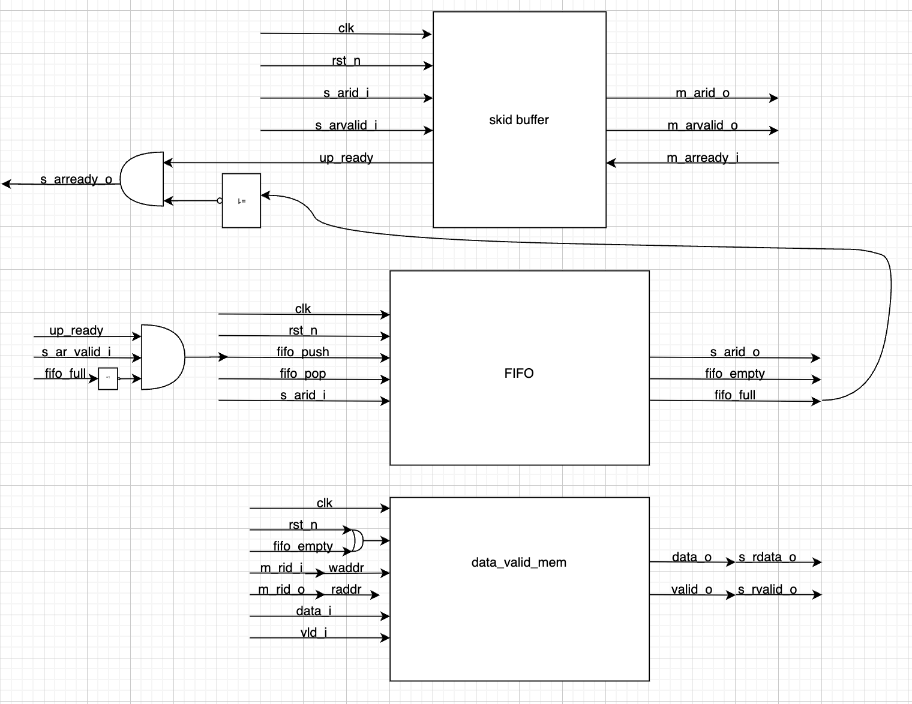

# Потоковый реордер буффер
- Описание принятых при проектировании решений:

Буффер представляет и себя модуль, который передает поток ID с AR slave устройства на AR master устройство, а также передает ID и данные с R master на R slave.

- Сторона AR Slave - AR master:

Для уменьшения задержки комб.логики и повышения пропускной способности буфера, на прием ID с AR slave поставлен skid buffer.

Также есть необходимость запоминать порядок приходящих ID, для этого используется FIFO.


- Сторона R master - R slave:

    Принято решение использовать память для хранения приходящих данных и значений их валидности. ID не хранятся, поскольку их значения лежат в диапазоне от 0 до 15, что не превышает размера регистра, поэтому каждый ID можно использовать как индекс для хранения элемента в массиве. Из FIFO всегда виден наружу элемент "снизу", что позволяет получить доступ к элементу, который в конкретный момент времени должен быть по очереди. Если он valid, то данные прочтутся, а указатель на чтение из FIFO сдвинется на 1.

- Идейная схема модуля:





- Описание работы спроектированных модулей:


На стороне AR Slave - AR master стоит skid buffer. Если master сторона вдруг выставит сигнал ready в ноль, то slave сторона сможет не сразу остановиться, а с задержкой в 1 такт. В буфере будут сохранены как значения на момент выставления ready в 0, так и на следующем такте, когда сигнал ready распространится назад по конвейеру. Если сигнал ready в единице, до данные перетекают через skid buffer каждый такт без задержек.


Также на стороне AR Slave - AR master стоит FIFO, которое сохраняет только валидные ID.
Оно нужно для сохранения порядка транзакций при дальнейшей обработке потока с R master.


На стороне R master - R slave есть память, в которую записываются только валидные данные и сигналы valid. Сигнал valid как бы говорит о том, что данные записаны в буфер, если он в нуле - значит данных ещё не было.

Запись в память происходит по указателю, которым является сигнал m_rid_i. Чтение из памяти происходит по указателю, которым является сигнал, выходящий из fifo.
От сигнала valid из памяти зависит, будем ли мы доставать следующий ID из FIFO. Такая схема обеспечивает поддержание порядка в обработке транзакций.

Чтобы скомпилировать модуль введите в терминале:
```
make compile
```

Чтобы запустить симуляцию введите в терминале:
```
make simulate
```